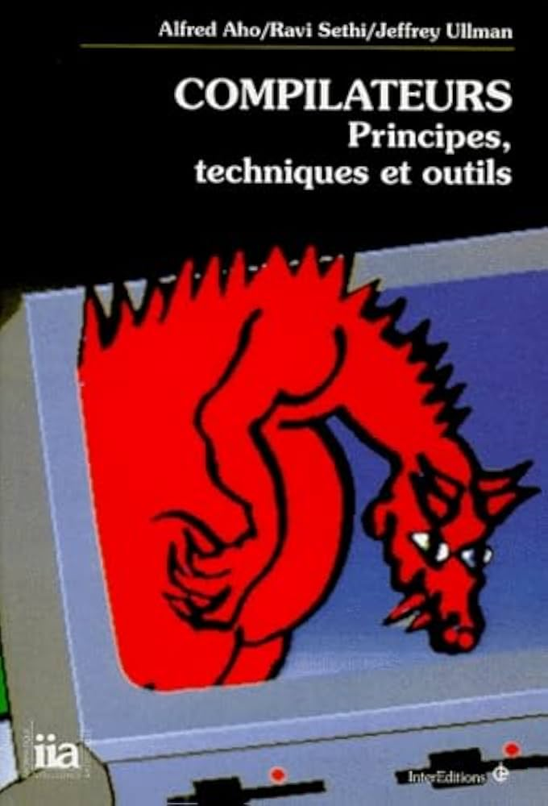

# Minishell en python

Il semblerait que le cursus de 42 soit en pleine mutation et que certains projets en C soient sur le point d’être remplacés par de nouveaux projets en Python.

Rien n’est sûr pour l’instant, mais minishell, un classique de 42, ferait partie de ceux qui pourraient passer à la trappe.

Pour me faire la main avec le langage, j’ai décidé de reproduire l’exercice en Python.\
Je vais essayer de me rapprocher au maximum des contraintes de la Norminette.

## General Rules:

• Your project must be written in Python 3.11 or later.\
• Your project must adhere to the flake8 coding standard. Bonus files are also subject to
this standard.\
• Your functions should handle exceptions gracefully to avoid crashes. 
Use try-except blocks to manage potential errors. If your program crashes due to unhandled exceptions during the review, it will be considered non-functional.\
• All resources(e.g.,filehandles,networkconnections) must be properly managed to prevent leaks.

## 2.2 Makefile

Include a Makefile in your project to automate common tasks. It must contain the following
rules:\
• install: Install project dependencies using pip, uv, pipx, or any other package manager
of your choice.\
• run: Execute the main script of your project.\
• debug: Run the main script in debug mode using Python’s built-in debugger.\
• clean: Remove temporary files or caches to keep the project environment clean.\
• lint: Lint your code using flake8 to ensure it meets coding standards.